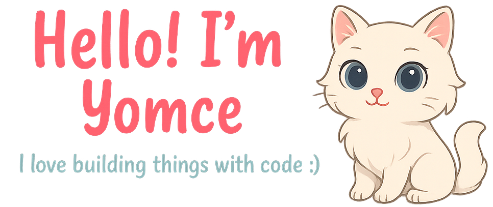

## **About me**

- 안녕하세요! 현재 알고리즘과 개발을 공부중인 코린이입니다 :-)

- 🌳 현재 크래프톤 정글에서 몰입 중

- 👩🏻‍💻 자료구조와 컴퓨터 시스템에 관심이 많아요

- 💬 컨택해주세요 :) [here](mailto:kky032911@gmail.com)

## Skills

### Frontend
<code></code>
<code></code>
<code></code>
<code></code>
<code></code>

### DevOps & Tools
<code></code>
<code></code>
<code></code>

### IDE & Group Tools
<code></code>
<code></code>
<code></code>

### CS & Backend
<code></code>
<code></code>

|  |  |
| ------------- | ------------- |

#### Top Repositories

 
 

